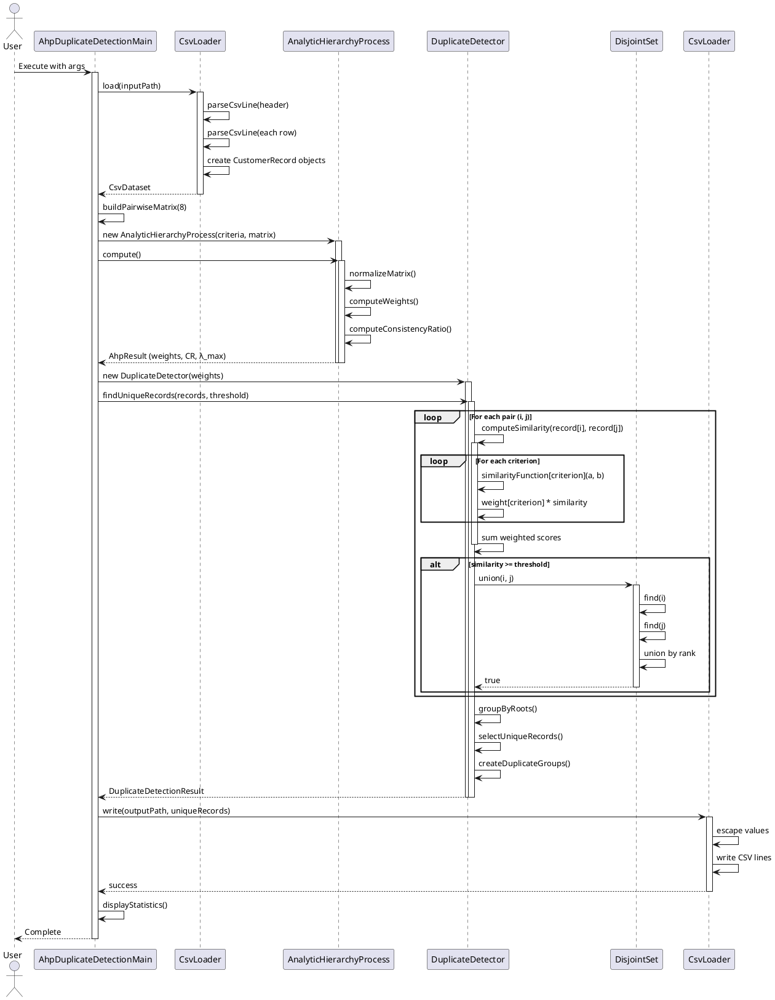
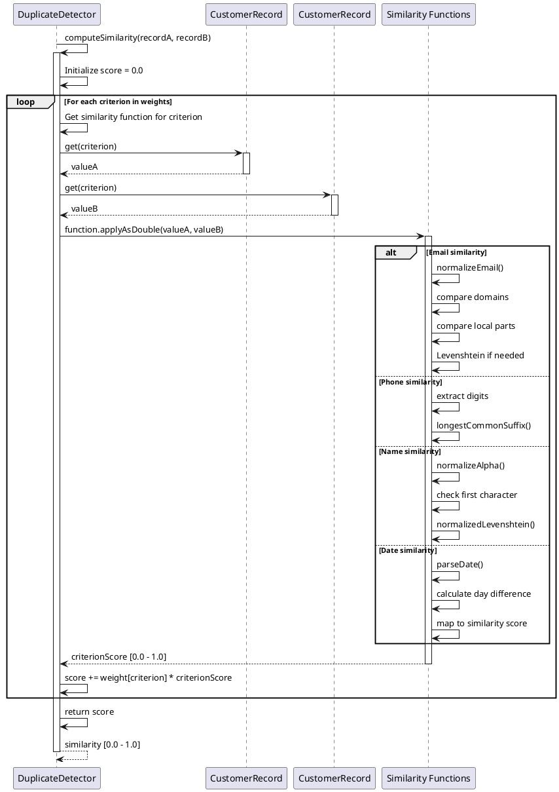
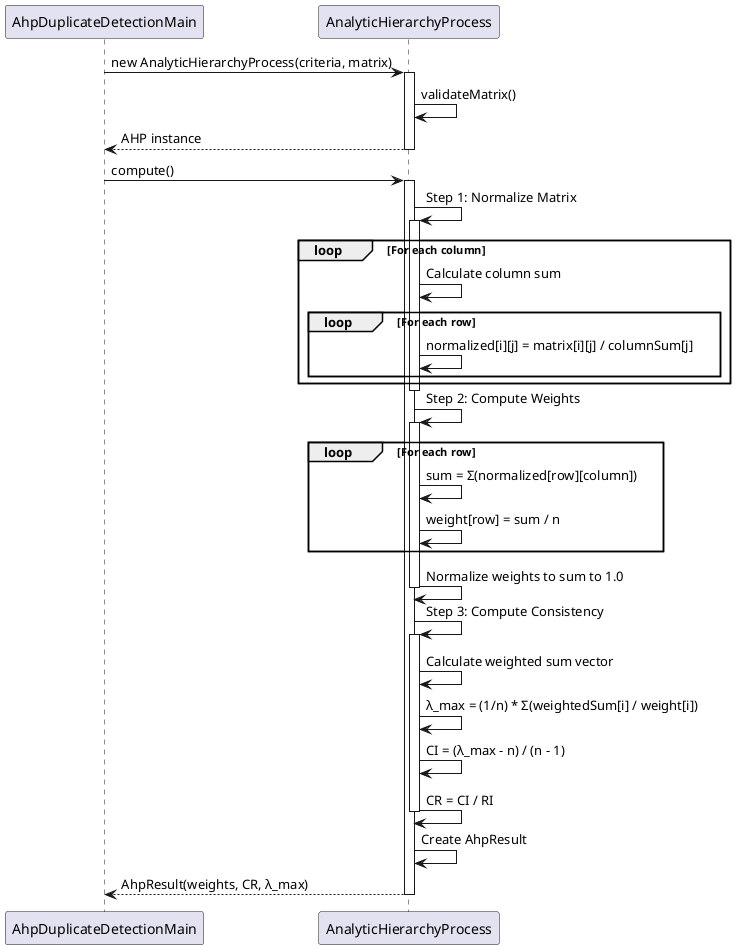

# Technical Design Document: AHP-Based Duplicate Detection System

## Table of Contents
1. [Overview](#overview)
2. [System Architecture](#system-architecture)
3. [Component Design](#component-design)
4. [Algorithm Details](#algorithm-details)
5. [Data Flow](#data-flow)
6. [Sequence Diagrams](#sequence-diagrams)
7. [Flow Charts](#flow-charts)
8. [Similarity Functions](#similarity-functions)
9. [Performance Considerations](#performance-considerations)

---

## Overview

The AHP-Based Duplicate Detection System is a sophisticated data deduplication solution that uses the **Analytic Hierarchy Process (AHP)** to intelligently weight customer attributes when identifying duplicate records. The system processes CSV files containing customer data and identifies duplicate entries based on weighted similarity scores across multiple criteria.

### Key Features
- **Multi-criteria Weighting**: Uses AHP to derive importance weights for 8 different customer attributes
- **Fuzzy Matching**: Implements various similarity algorithms (Levenshtein distance, normalization, etc.)
- **Union-Find Clustering**: Groups duplicate records using Disjoint Set data structure
- **Configurable Threshold**: Allows tuning of similarity threshold for duplicate detection

### Input/Output
- **Input**: CSV file with customer records (Email, Phone, FirstName, LastName, PostalCode, City, CarMake, PurchaseDate)
- **Output**: Deduplicated CSV file with unique records and duplicate group information

---

## System Architecture

### High-Level Architecture

```
┌─────────────────────────────────────────────────────────────────┐
│                    AhpDuplicateDetectionMain                    │
│                         (Entry Point)                          │
└────────────────────────────┬────────────────────────────────────┘
                             │
                ┌────────────┴────────────┐
                │                         │
                ▼                         ▼
    ┌──────────────────────┐   ┌──────────────────────┐
    │     CsvLoader        │   │  Pairwise Matrix     │
    │  (Data Loading)      │   │   Construction       │
    └──────────┬───────────┘   └──────────┬───────────┘
               │                          │
               ▼                          ▼
    ┌──────────────────────┐   ┌──────────────────────┐
    │  CustomerRecord      │   │ AnalyticHierarchy    │
    │   (Data Model)       │   │     Process          │
    └──────────────────────┘   │  (Weight Calculation)│
                               └──────────┬───────────┘
                                          │
                                          ▼
                               ┌──────────────────────┐
                               │   DuplicateDetector   │
                               │  (Similarity & Group) │
                               └──────────┬───────────┘
                                          │
                    ┌─────────────────────┼─────────────────────┐
                    │                     │                     │
                    ▼                     ▼                     ▼
        ┌──────────────────┐  ┌──────────────────┐  ┌──────────────────┐
        │ Similarity        │  │   DisjointSet    │  │DuplicateDetection│
        │ Functions         │  │  (Union-Find)    │  │     Result       │
        └──────────────────┘  └──────────────────┘  └──────────────────┘
```

### Component Relationships

1. **AhpDuplicateDetectionMain**: Orchestrates the entire workflow
2. **CsvLoader**: Handles CSV file I/O operations
3. **CustomerRecord**: Represents a single customer record
4. **AnalyticHierarchyProcess**: Computes attribute weights using AHP
5. **DuplicateDetector**: Performs similarity calculations and duplicate grouping
6. **DisjointSet**: Implements Union-Find algorithm for clustering
7. **DuplicateDetectionResult**: Contains results and statistics

---

## Component Design

### 1. AhpDuplicateDetectionMain

**Purpose**: Main entry point that orchestrates the duplicate detection workflow.

**Responsibilities**:
- Parse command-line arguments (input file, output file, threshold)
- Load CSV data
- Build pairwise comparison matrix
- Initialize AHP computation
- Execute duplicate detection
- Write results to output file
- Display statistics and top duplicate groups

**Key Methods**:
- `main(String[] args)`: Entry point
- `buildPairwiseMatrix(int size)`: Constructs 8x8 pairwise comparison matrix
- `parseThreshold(String value)`: Validates and parses threshold parameter

### 2. CsvLoader

**Purpose**: Handles CSV file reading and writing operations.

**Responsibilities**:
- Parse CSV files with proper handling of quoted fields
- Convert CSV rows to CustomerRecord objects
- Write CustomerRecord objects back to CSV format
- Handle CSV escaping (commas, quotes, newlines)

**Key Methods**:
- `load(Path path)`: Reads CSV and returns CsvDataset
- `write(Path path, CsvDataset dataset)`: Writes dataset to CSV file
- `parseCsvLine(String line)`: Parses a single CSV line with quote handling
- `escape(String value)`: Escapes special characters for CSV output

**Data Structure**:
```java
record CsvDataset(List<String> headers, List<CustomerRecord> records)
```

### 3. CustomerRecord

**Purpose**: Immutable data model representing a single customer record.

**Responsibilities**:
- Store customer attributes as key-value pairs
- Provide accessor methods for field retrieval
- Maintain field order (LinkedHashMap)

**Key Methods**:
- `get(String fieldName)`: Retrieves field value
- `getFields()`: Returns copy of all fields
- `getCustomerId()`: Returns customer ID

### 4. AnalyticHierarchyProcess

**Purpose**: Implements the Analytic Hierarchy Process algorithm to compute criterion weights.

**Algorithm Steps**:
1. **Normalize Matrix**: Normalize each column of the pairwise comparison matrix
2. **Compute Weights**: Calculate average of each row in normalized matrix
3. **Normalize Weights**: Ensure weights sum to 1.0
4. **Compute Consistency**: Calculate consistency ratio (CR) to validate matrix quality

**Mathematical Formula**:
- Normalized value: `normalized[i][j] = matrix[i][j] / columnSum[j]`
- Weight: `weight[i] = (sum of row i) / n`
- Lambda Max: `λ_max = (1/n) * Σ(weightedSum[i] / weight[i])`
- Consistency Ratio: `CR = (λ_max - n) / ((n - 1) * RI)`

**Key Methods**:
- `compute()`: Main computation method returning AhpResult
- `validateMatrix(double[][] matrix, int expectedSize)`: Validates matrix structure

**Result Structure**:
```java
class AhpResult {
    Map<String, Double> weights;      // Criterion weights
    double consistencyRatio;          // CR value (< 0.1 is acceptable)
    double lambdaMax;                 // Maximum eigenvalue
}
```

### 5. DuplicateDetector

**Purpose**: Core component that performs similarity calculations and duplicate grouping.

**Responsibilities**:
- Compute weighted similarity scores between record pairs
- Apply threshold to identify duplicates
- Group duplicates using DisjointSet
- Generate unique records and duplicate groups

**Key Methods**:
- `findUniqueRecords(List<CustomerRecord> records, double threshold)`: Main detection method
- `computeSimilarity(CustomerRecord a, CustomerRecord b)`: Calculates weighted similarity
- `buildSimilarityFunctions()`: Initializes criterion-specific similarity functions

**Similarity Calculation**:
```java
similarity = Σ(weight[i] * similarityFunction[i](recordA, recordB))
```

### 6. DisjointSet (Union-Find)

**Purpose**: Efficiently groups duplicate records using Union-Find data structure.

**Algorithm**: Union-Find with path compression and union by rank.

**Operations**:
- `find(int x)`: Finds root with path compression
- `union(int x, int y)`: Merges two sets using union by rank

**Time Complexity**: 
- Find: O(α(n)) amortized (α is inverse Ackermann function, effectively constant)
- Union: O(α(n)) amortized

### 7. DuplicateDetectionResult

**Purpose**: Container for duplicate detection results and statistics.

**Contains**:
- List of unique records
- List of duplicate groups
- Threshold used
- Number of comparisons evaluated
- Average similarity score
- Total duplicate record count

**Nested Class**:
```java
class DuplicateGroup {
    List<CustomerRecord> records;
    double strongestSimilarity;  // Highest similarity in group
    CustomerRecord representative();  // First record (canonical)
}
```

---

## Algorithm Details

### Overall Workflow Algorithm

```
1. Load CSV data → CustomerRecord list
2. Build pairwise comparison matrix (8x8)
3. Compute AHP weights:
   a. Normalize pairwise matrix
   b. Calculate row averages (weights)
   c. Normalize weights to sum to 1.0
   d. Compute consistency ratio
4. Initialize DuplicateDetector with weights
5. For each pair (i, j) where i < j:
   a. Compute weighted similarity score
   b. If similarity >= threshold:
      - Union records i and j in DisjointSet
6. Group records by DisjointSet roots
7. Select first record from each group as unique
8. Generate duplicate groups for groups with size > 1
9. Write unique records to output CSV
```

### Pairwise Comparison Matrix

The system uses a predefined 8x8 matrix comparing 8 criteria:
1. Email (highest weight)
2. Phone
3. FirstName
4. LastName
5. PostalCode
6. City
7. CarMake
8. PurchaseDate (lowest weight)

Matrix values follow AHP scale:
- 1 = Equal importance
- 3 = Moderate importance
- 5 = Strong importance
- 7 = Very strong importance
- 9 = Extreme importance
- Reciprocals (1/3, 1/5, etc.) for inverse relationships

### Similarity Computation Algorithm

```
For each criterion:
  1. Extract values from both records
  2. Normalize values (lowercase, trim, remove special chars)
  3. Apply criterion-specific similarity function
  4. Multiply by criterion weight
  5. Sum all weighted scores
```

---

## Data Flow

### Input Data Flow

```
CSV File
  │
  ├─→ CsvLoader.load()
  │     │
  │     ├─→ Parse headers
  │     ├─→ Parse each row
  │     └─→ Create CustomerRecord objects
  │
  └─→ List<CustomerRecord>
```

### Processing Data Flow

```
List<CustomerRecord>
  │
  ├─→ AnalyticHierarchyProcess
  │     │
  │     ├─→ Pairwise Matrix (8x8)
  │     ├─→ Normalize columns
  │     ├─→ Compute row averages
  │     └─→ Map<String, Double> weights
  │
  ├─→ DuplicateDetector
  │     │
  │     ├─→ For each pair (i, j):
  │     │     │
  │     │     ├─→ Compute similarity
  │     │     │     │
  │     │     │     ├─→ Email similarity
  │     │     │     ├─→ Phone similarity
  │     │     │     ├─→ FirstName similarity
  │     │     │     ├─→ LastName similarity
  │     │     │     ├─→ PostalCode similarity
  │     │     │     ├─→ City similarity
  │     │     │     ├─→ CarMake similarity
  │     │     │     └─→ PurchaseDate similarity
  │     │     │
  │     │     └─→ Weighted sum
  │     │
  │     └─→ DisjointSet.union() if similarity >= threshold
  │
  └─→ Group by DisjointSet roots
        │
        ├─→ Unique records (first from each group)
        └─→ Duplicate groups (groups with size > 1)
```

### Output Data Flow

```
DuplicateDetectionResult
  │
  ├─→ Unique records → CsvLoader.write() → Output CSV
  └─→ Duplicate groups → Console output (top 5)
```

---

## Sequence Diagrams

### Main Workflow Sequence Diagram



### Similarity Computation Sequence Diagram



### AHP Weight Computation Sequence Diagram



---

## Flow Charts

### Main Program Flow

```
┌─────────────────────┐
│   START              │
└──────────┬──────────┘
           │
           ▼
┌─────────────────────┐
│ Parse Arguments     │
│ - Input CSV path    │
│ - Output CSV path   │
│ - Threshold         │
└──────────┬──────────┘
           │
           ▼
┌─────────────────────┐
│ Load CSV File       │
│ (CsvLoader.load)    │
└──────────┬──────────┘
           │
           ▼
┌─────────────────────┐
│ Build Pairwise      │
│ Comparison Matrix   │
│ (8x8 matrix)        │
└──────────┬──────────┘
           │
           ▼
┌─────────────────────┐
│ Compute AHP Weights │
│ (AnalyticHierarchy  │
│  Process.compute)   │
└──────────┬──────────┘
           │
           ▼
┌─────────────────────┐
│ Initialize          │
│ DuplicateDetector   │
│ with weights        │
└──────────┬──────────┘
           │
           ▼
┌─────────────────────┐
│ Find Unique Records │
│ (DuplicateDetector  │
│  .findUniqueRecords)│
└──────────┬──────────┘
           │
           ▼
┌─────────────────────┐
│ Write Output CSV    │
│ (CsvLoader.write)   │
└──────────┬──────────┘
           │
           ▼
┌─────────────────────┐
│ Display Statistics  │
│ and Top Duplicates  │
└──────────┬──────────┘
           │
           ▼
┌─────────────────────┐
│   END               │
└─────────────────────┘
```

### Duplicate Detection Flow

```
┌─────────────────────┐
│ START Detection     │
│ Input: Records,     │
│        Threshold    │
└──────────┬──────────┘
           │
           ▼
┌─────────────────────┐
│ Initialize          │
│ DisjointSet(n)      │
└──────────┬──────────┘
           │
           ▼
┌─────────────────────┐
│ i = 0               │
└──────────┬──────────┘
           │
           ▼
┌─────────────────────┐
│ j = i + 1           │
└──────────┬──────────┘
           │
           ▼
┌─────────────────────┐
│ Compute Similarity  │
│ score[i][j]         │
└──────────┬──────────┘
           │
           ▼
┌─────────────────────┐
│ similarity >=       │
│ threshold?          │
└─────┬───────────┬───┘
      │ YES       │ NO
      ▼           ▼
┌──────────┐  ┌──────────┐
│ Union    │  │ Skip     │
│ (i, j)   │  │          │
└────┬─────┘  └────┬─────┘
     │             │
     └─────┬───────┘
           │
           ▼
┌─────────────────────┐
│ j++                 │
└─────┬───────────────┘
      │
      ▼
┌─────────────────────┐
│ j < n?              │
└─────┬───────────┬───┘
      │ YES       │ NO
      │           │
      └───────────┼───┐
                  │   │
                  ▼   ▼
           ┌─────────────────────┐
           │ i++                 │
           └─────┬───────────────┘
                 │
                 ▼
           ┌─────────────────────┐
           │ i < n - 1?          │
           └─────┬───────────┬───┘
                 │ YES       │ NO
                 │           │
                 └───────────┼───┐
                             │   │
                             └───┘
                                 │
                                 ▼
                    ┌─────────────────────┐
                    │ Group by Roots      │
                    │ (DisjointSet.find)  │
                    └──────────┬──────────┘
                               │
                               ▼
                    ┌─────────────────────┐
                    │ Select First Record │
                    │ from Each Group     │
                    └──────────┬──────────┘
                               │
                               ▼
                    ┌─────────────────────┐
                    │ Create Duplicate    │
                    │ Groups (size > 1)   │
                    └──────────┬──────────┘
                               │
                               ▼
                    ┌─────────────────────┐
                    │ Return Result       │
                    └─────────────────────┘
```

### Similarity Computation Flow

```
┌─────────────────────┐
│ START Similarity    │
│ Input: Record A,    │
│        Record B     │
└──────────┬──────────┘
           │
           ▼
┌─────────────────────┐
│ Initialize          │
│ score = 0.0         │
└──────────┬──────────┘
           │
           ▼
┌─────────────────────┐
│ For each criterion  │
│ in weights map      │
└──────────┬──────────┘
           │
           ▼
┌─────────────────────┐
│ Get valueA from     │
│ Record A            │
└──────────┬──────────┘
           │
           ▼
┌─────────────────────┐
│ Get valueB from     │
│ Record B            │
└──────────┬──────────┘
           │
           ▼
┌─────────────────────┐
│ Get similarity      │
│ function for        │
│ criterion           │
└──────────┬──────────┘
           │
           ▼
┌─────────────────────┐
│ Apply similarity    │
│ function(valueA,    │
│          valueB)    │
└──────────┬──────────┘
           │
           ▼
┌─────────────────────┐
│ criterionScore =    │
│ function result     │
│ [0.0 - 1.0]         │
└──────────┬──────────┘
           │
           ▼
┌─────────────────────┐
│ score +=            │
│ weight[criterion] * │
│ criterionScore      │
└──────────┬──────────┘
           │
           ▼
┌─────────────────────┐
│ More criteria?      │
└─────┬───────────┬───┘
      │ YES       │ NO
      │           │
      └───────────┼───┐
                  │   │
                  └───┘
                      │
                      ▼
           ┌─────────────────────┐
           │ Return score        │
           │ [0.0 - 1.0]         │
           └─────────────────────┘
```

### AHP Weight Computation Flow

```
┌─────────────────────┐
│ START AHP           │
│ Input: Criteria,    │
│        Pairwise     │
│        Matrix       │
└──────────┬──────────┘
           │
           ▼
┌─────────────────────┐
│ Validate Matrix     │
│ (square, positive)  │
└──────────┬──────────┘
           │
           ▼
┌─────────────────────┐
│ Step 1: Normalize   │
│ Matrix              │
└──────────┬──────────┘
           │
           ▼
┌─────────────────────┐
│ For each column j:  │
│   sum = Σ(matrix[i][j])
│   For each row i:   │
│     normalized[i][j]│
│       = matrix[i][j]│
│       / sum         │
└──────────┬──────────┘
           │
           ▼
┌─────────────────────┐
│ Step 2: Compute     │
│ Weights             │
└──────────┬──────────┘
           │
           ▼
┌─────────────────────┐
│ For each row i:     │
│   weight[i] =       │
│     Σ(normalized[i][j])
│     / n             │
└──────────┬──────────┘
           │
           ▼
┌─────────────────────┐
│ Normalize weights   │
│ to sum to 1.0       │
└──────────┬──────────┘
           │
           ▼
┌─────────────────────┐
│ Step 3: Compute     │
│ Consistency         │
└──────────┬──────────┘
           │
           ▼
┌─────────────────────┐
│ Calculate weighted  │
│ sum vector          │
└──────────┬──────────┘
           │
           ▼
┌─────────────────────┐
│ λ_max =             │
│ (1/n) * Σ(          │
│   weightedSum[i] /  │
│   weight[i])        │
└──────────┬──────────┘
           │
           ▼
┌─────────────────────┐
│ CI = (λ_max - n) /  │
│      (n - 1)        │
└──────────┬──────────┘
           │
           ▼
┌─────────────────────┐
│ CR = CI / RI        │
│ (RI from lookup)    │
└──────────┬──────────┘
           │
           ▼
┌─────────────────────┐
│ Return AhpResult    │
│ (weights, CR, λ_max)│
└─────────────────────┘
```

---

## Similarity Functions

### 1. Email Similarity

**Algorithm**:
```
1. Normalize emails (lowercase, trim)
2. If emails are equal → return 1.0
3. Split by '@' to get local and domain parts
4. If domains match → add 0.3
5. If local parts match → add 0.7
6. Else if simplified local parts match (alphanumeric only) → add 0.6
7. Else → use normalized Levenshtein distance * 0.6
8. Return min(1.0, score)
```

**Example**:
- `john.doe@email.com` vs `johndoe@email.com` → High similarity (0.9+)
- `john@email.com` vs `john@gmail.com` → Lower similarity (0.3)

### 2. Phone Similarity

**Algorithm**:
```
1. Extract digits only from both phone numbers
2. If digit strings are equal → return 1.0
3. Calculate longest common suffix
4. If suffix >= 7 digits and minLength >= 7 → return 0.7
5. If suffix >= 4 digits and minLength >= 4 → return 0.4
6. Else → return 0.0
```

**Example**:
- `(555) 123-4567` vs `555-123-4567` → 1.0 (exact match)
- `555-123-4567` vs `555-123-4568` → 0.7 (7-digit suffix match)

### 3. Name Similarity (FirstName/LastName)

**Algorithm**:
```
1. Normalize (lowercase, remove non-alphabetic)
2. If equal → return 1.0
3. If first characters match → return 0.6
4. Else → return normalized Levenshtein distance
```

**Example**:
- `John` vs `Jon` → High similarity (Levenshtein)
- `John` vs `Jane` → Lower similarity (different first char)

### 4. Postal Code Similarity

**Algorithm**:
```
1. Trim both postal codes
2. If equal → return 1.0
3. If first 3 characters match → return 0.5
4. Else → return 0.0
```

**Example**:
- `12345` vs `12345` → 1.0
- `12345` vs `12346` → 0.5 (first 3 match)

### 5. City Similarity

**Algorithm**:
```
1. Normalize (lowercase, remove non-alphabetic)
2. If equal → return 1.0
3. Else → return normalized Levenshtein distance
```

### 6. Car Make Similarity

**Algorithm**:
```
1. Normalize (lowercase, trim)
2. If equal → return 1.0
3. Else → return 0.0 (exact match only)
```

### 7. Purchase Date Similarity

**Algorithm**:
```
1. Parse dates (yyyy-MM-dd format)
2. If either is null → return 0.0
3. Calculate absolute day difference
4. Map to similarity:
   - 0 days → 1.0
   - 1-3 days → 0.8
   - 4-7 days → 0.6
   - 8-30 days → 0.3
   - >30 days → 0.0
```

**Example**:
- `2024-01-15` vs `2024-01-15` → 1.0
- `2024-01-15` vs `2024-01-17` → 0.8 (2 days)

### Levenshtein Distance

**Algorithm** (Dynamic Programming):
```
1. Create DP table [m+1][n+1]
2. Initialize first row and column with indices
3. For each cell (i, j):
   - cost = 0 if chars match, else 1
   - dp[i][j] = min(
       dp[i-1][j] + 1,      // deletion
       dp[i][j-1] + 1,      // insertion
       dp[i-1][j-1] + cost  // substitution
     )
4. Return dp[m][n]
5. Normalize: similarity = 1 - (distance / maxLength)
```

**Time Complexity**: O(m * n) where m, n are string lengths

---

## Performance Considerations

### Time Complexity

1. **CSV Loading**: O(n) where n = number of records
2. **AHP Computation**: O(k²) where k = number of criteria (8) → O(1) constant
3. **Similarity Computation**: 
   - Per pair: O(k * m) where k = criteria count, m = average string length
   - Total pairs: O(n²)
   - Overall: **O(n² * k * m)**
4. **Union-Find Operations**: O(n² * α(n)) where α is inverse Ackermann (effectively constant)
5. **Grouping**: O(n)

**Overall Complexity**: **O(n² * k * m)** where:
- n = number of records
- k = number of criteria (8)
- m = average string length

### Space Complexity

1. **CSV Data**: O(n * f) where f = number of fields
2. **DisjointSet**: O(n)
3. **Similarity scores**: O(1) (computed on-the-fly, not stored)
4. **AHP matrices**: O(k²) = O(1)

**Overall Space**: **O(n * f)**

### Optimization Opportunities

1. **Early Termination**: Skip comparisons if key fields (Email, Phone) don't match
2. **Indexing**: Create indexes on Email and Phone for faster candidate selection
3. **Blocking**: Group records by postal code or city before comparing
4. **Parallel Processing**: Parallelize pairwise comparisons
5. **Sampling**: For very large datasets, use sampling for threshold tuning

### Scalability

- **Current Design**: Suitable for datasets up to ~10,000 records
- **Large Datasets (>100K)**: Requires blocking/indexing strategies
- **Memory**: Linear with dataset size

---

## Configuration

### Default Parameters

- **Threshold**: 0.78 (configurable via command line)
- **Pairwise Matrix**: Hardcoded 8x8 matrix (can be externalized)
- **Criteria**: 8 fixed criteria (Email, Phone, FirstName, LastName, PostalCode, City, CarMake, PurchaseDate)

### Threshold Guidelines

- **0.90-1.0**: Very strict (only near-exact matches)
- **0.75-0.90**: Balanced (recommended)
- **0.60-0.75**: Lenient (may include false positives)
- **<0.60**: Very lenient (high false positive rate)

### AHP Consistency Ratio

- **CR < 0.1**: Acceptable consistency
- **CR 0.1-0.2**: Marginal consistency (review matrix)
- **CR > 0.2**: Inconsistent (revise pairwise comparisons)

---

## Error Handling

1. **CSV Parsing Errors**: Throws IOException with line number
2. **Invalid Threshold**: Validates range (0, 1) exclusive
3. **Matrix Validation**: Ensures square matrix with positive values
4. **Empty Datasets**: Returns empty result gracefully
5. **Date Parsing**: Returns 0.0 similarity for invalid dates

---

## Testing Considerations

### Unit Test Scenarios

1. **Email Similarity**: Various email formats and typos
2. **Phone Similarity**: Different formatting, partial matches
3. **Name Similarity**: Typos, abbreviations, case variations
4. **Date Similarity**: Various date differences
5. **AHP Computation**: Known matrices with expected weights
6. **Union-Find**: Various grouping scenarios

### Integration Test Scenarios

1. **End-to-end**: Full workflow with sample CSV
2. **Edge Cases**: Empty file, single record, all duplicates
3. **Threshold Variations**: Test different threshold values
4. **Large Datasets**: Performance with 1000+ records

---

## Conclusion

The AHP-Based Duplicate Detection System provides a sophisticated, mathematically-grounded approach to identifying duplicate customer records. By combining the Analytic Hierarchy Process for intelligent weighting with fuzzy matching algorithms and efficient clustering, the system achieves high accuracy in duplicate detection while maintaining reasonable performance for moderate-sized datasets.

The modular design allows for easy extension with additional similarity functions, criteria, or optimization strategies as needed.

